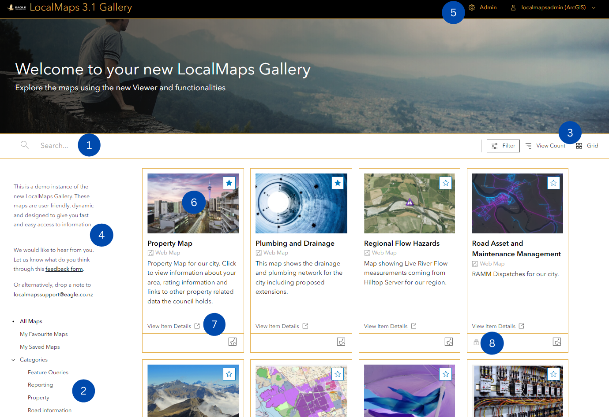

The LocalMaps Gallery is your central mapping destination! This page outlines how to navigate the Gallery to find what you are looking for.

## Navigating around the gallery

1. **Search** - Search for content by title or keyword by using the top right search bar.
2. **Categories** - Filter gallery content down to a defined subgroup using the left hand side Categories.
3. **Sort by & layout** - Change the sorting of the gallery by Most Views, Title or Most recent. Optionally change the gallery layout to listed or as gallery cards (default)
4. **About LocalMaps** - Read about the site and how to use it
5. **Log in** - Log into LocalMaps using an ArcGIS Login (to access secure content)
6. **Content Card** - View maps and other spatial content by clicking on a card
7. **Metadata** - View item information about each application or map
8. **Secure Content** - Secure items are identified with a small lock symbol. These are only available once logged in

**Additional Links** - Any additional links and information can be accessed in the bottom footer.
